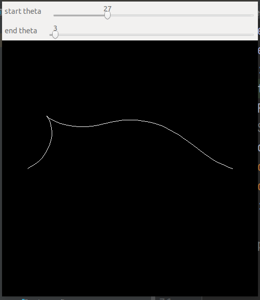

# teb_local_planner
teb local planner without ros, teb 局部路径规划算法，非ROS版本移植，可以自行在项目中当作一个库进行调用

原始的代码和相关论文请参考原始的teb工程
https://github.com/rst-tu-dortmund/teb_local_planner

# 调用流程

## 编译依赖项

* g2o 
* Eigen 
* Boost 
* OpenCV (可选，用于显示地图和路径)

## 代码运行

代码运行成功时，会出现一个窗口和两个滑动条，通过滑动条可以控制起始点和目标点的角度，从而控制轨迹的形状。

## teb库调用流程

本代码核心在于能够将teb算法作为一个开源第三方库来调用，而不采用ros的数据接口，稍微阅读了解原理后也可以直接修改库来实现自己的序需求。

因此，通常的调用流程如下
* 加载默认参数
`TebConfig config;` ,其中在构造函数内保留了所有默认参数值，可以自行修改

* 设置障碍物
`std::vector<ObstaclePtr> obst_vector;`

* 设置机器人形状
`RobotFootprintModelPtr robot_model = boost::make_shared<CircularRobotFootprint>(0.4);`

* 构造路径规划类
`auto planner = new TebOptimalPlanner(config, &obst_vector, robot_model, visual, &via_points);`

* 搜索路径
`planner->plan(start,end);`

* 获取规划得到的轨迹 
`planner->getFullTrajectory(path);`

